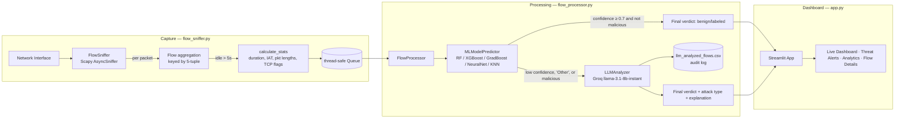
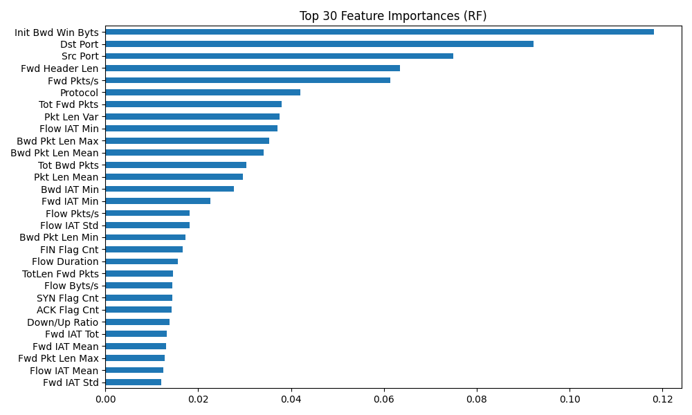

# 🛡️ VPN-Detection — AI Network Security Analyzer

Real-time network intrusion detection: a live packet sniffer turns raw traffic into flow-level statistics, a swappable ML model classifies each flow, and any flow the model is unsure about (or flags as malicious) gets a second opinion from an LLM — all surfaced on a live Streamlit dashboard.

## Architecture



## How it works

**1. Live capture & flow aggregation** (`flow_sniffer.py`) — an async Scapy sniffer runs on a background thread, grouping packets into bidirectional flows keyed by a canonicalized `(src_ip, dst_ip, src_port, dst_port, protocol)` tuple so both directions of a connection map to the same flow. A second thread expires and finalizes any flow idle for more than `FLOW_TIMEOUT_SECONDS` (5s), computing ~40 CICFlowMeter-style statistics per flow — packet-length min/mean/max/std (forward and backward separately), inter-arrival times, TCP flag counts (SYN/FIN/RST/ACK/PSH/URG), header lengths, and byte/packet rates — and pushes the result onto a thread-safe queue.

**2. ML classification** (`ml_predictor.py`) — flows are pulled off the queue and scored by one of five pre-trained models (Random Forest, XGBoost, Gradient Boosting, a Keras neural network, or KNN), selectable live from the dashboard sidebar without restarting the app. Feature preprocessing handles the gap between what the live sniffer produces and what the trained model expects — deriving missing rate/ratio features on the fly and cleaning NaN/inf values — before scaling with a shared `StandardScaler` and decoding the prediction with a shared `LabelEncoder`.

**3. LLM escalation** (`llm_analyzer.py`) — a flow is routed to a Groq-hosted LLM (`llama-3.1-8b-instant` via LangChain) when the ML model's confidence drops below 70%, predicts an ambiguous `"Other"` class, or flags the flow as malicious. The LLM returns a structured verdict (prediction, attack type, confidence, explanation) that overrides the ML label as the flow's final verdict, and every LLM call is logged to `llm_analyzed_flows.csv` as an audit trail.

**4. Live dashboard** (`app.py`) — a Streamlit app with four tabs: a live-updating overview with benign/malicious counts and average confidence, a threat-alert feed, Plotly analytics (threat distribution, protocol breakdown, confidence histogram), and a filterable/sortable flow-detail table with full ML + LLM reasoning per flow. Auto-refreshes every 5 seconds.

## Model training (`train_with_flow_features.py`)

Trains against a labeled flow dataset (`combined_dataset.csv`, not included), using only the features the live sniffer can actually produce. Class imbalance is handled with SMOTE oversampling on the training split before fitting; outputs a confusion matrix and a feature-importance chart alongside the model artifact.

**Feature importance** (Random Forest, `artifacts/`):



## Tech stack

Python, Scapy, Streamlit, Plotly, scikit-learn, XGBoost, TensorFlow/Keras, imbalanced-learn (SMOTE), LangChain + Groq.

## Setup

```bash
pip install -r requirements.txt
```

Create a `.env` file with:

```
GROQ_API_KEY=your_groq_api_key
```

Packet capture requires elevated privileges (npcap on Windows, or `sudo` on Linux/Mac) and picks up your active network interface automatically via `Interface_name.py`.

Run the dashboard:

```bash
streamlit run app.py
```

## Known limitations

- **LLM escalation currently fails at runtime.** The committed `llm_analyzed_flows.csv` audit log shows every LLM call erroring out — LangChain's `ChatPromptTemplate` treats the unescaped `{` `}` braces in the JSON-format instructions inside `LLM_PROMPTS["network_analysis"]` (`config.py`) as template variables. Fix: escape them as `{{` `}}` in the prompt template.
- **Train/serve feature mismatch.** `train_with_flow_features.py` trains on a simplified 14-feature set and saves to `artifacts_simple/`, while the models actually loaded at runtime (`artifacts/`, referenced by `config.py`) expect the full 39-column `FEATURE_COLUMNS` schema — those production artifacts were trained by an earlier/unincluded script.
- Sniffing requires the app to run with elevated OS privileges, and the target interface is auto-selected as the first "up" interface, which may not always be the intended one on multi-NIC machines.

## Project structure

```
app.py                        # Streamlit dashboard (4 tabs, live auto-refresh)
flow_sniffer.py                # Scapy capture, flow aggregation, statistical features
flow_processor.py              # ML → (conditional) LLM pipeline, audit logging
ml_predictor.py                 # Loads/serves RF, XGBoost, GradBoost, NN, KNN models
llm_analyzer.py                 # Groq LLM escalation for low-confidence/malicious flows
config.py                       # Model paths, feature schema, LLM prompt templates
Interface_name.py               # Active network interface auto-detection
train_with_flow_features.py     # Offline training: SMOTE + scaling + RandomForest
test_prediction.py              # Manual smoke test for the ML predictor
artifacts/                      # Trained models, scaler, label encoder, evaluation plots
```

## Disclaimer

Built for educational / research purposes on traffic you own or have authorization to monitor.
